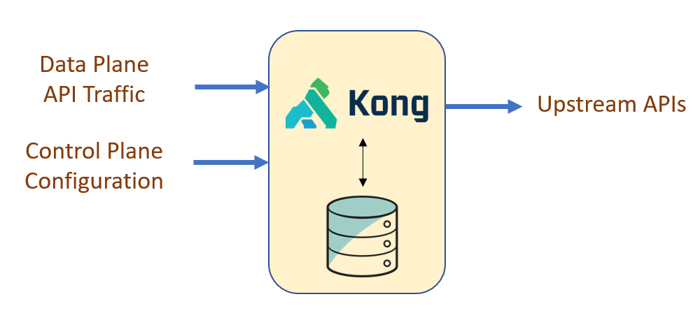
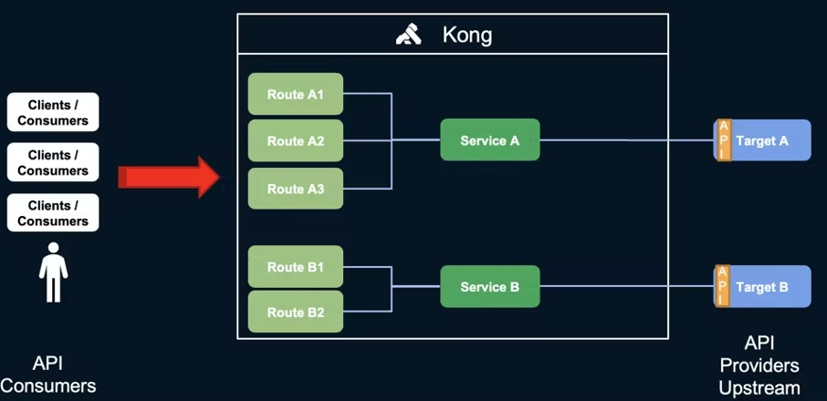
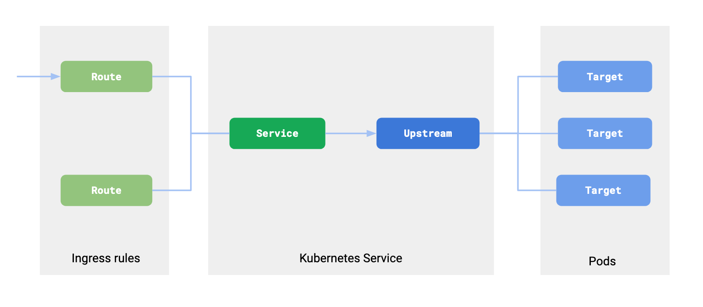

# Kong Anatomy

## Anatomy

There are two important components in Kong.

1. Data Plane
2. Control Plane

## Data Plane

The data plane is the part of Kong that handles the actual API proxy that is built using NGINX. This is where the routing happens and all the filters and configuration policy is applied to the requests.

## Control Plane

Kong also has a control plane for the admin/developers. This component exposes an API where developers can manage Kong by setting policies and configuring routes and services. All those configurations can be store in two (or three) ways. They are called Persistence Models.

### Kong DB Mode

In DB Mode, all configuration will be stored in a database.

KONG supports two databases (although one is deprecated)

- Cassandra (already deprecated from KONG v3 or later)
- PostgreSQL (only supports versions 9.5 or later)### Supported Databases

### Kong DB-Less Mode (Declarative Mode)

In declarative mode, all Kong configuration can be stored in a `kong.yaml` file, and will remain in RAM when it is running.

The recommended way of using Kong in production is **_Declarative Mode_**. It works much better with horizontal scaling and DevOps Continuous Integration.

### Hybrid Mode

In hybrid mode, you can get access to both features; deploying Kong from a configuration file, but also having a database.

## Kong Terminologies

### Upstream

Upstreams or Upstream Servers are the APIs that the gateway will forward requests to.

So in our case, our _Gateway_ is the **proxy** and the _API_ is the **upstream**.

### Service

Services are what will connect Kong Gateway to the Upstream Servers (your API).

### Route

Routes are the endpoints that you will create that will map/redirect the request to the service.

