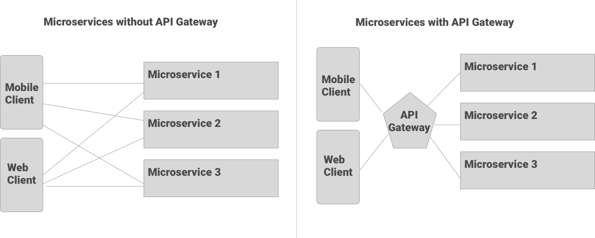
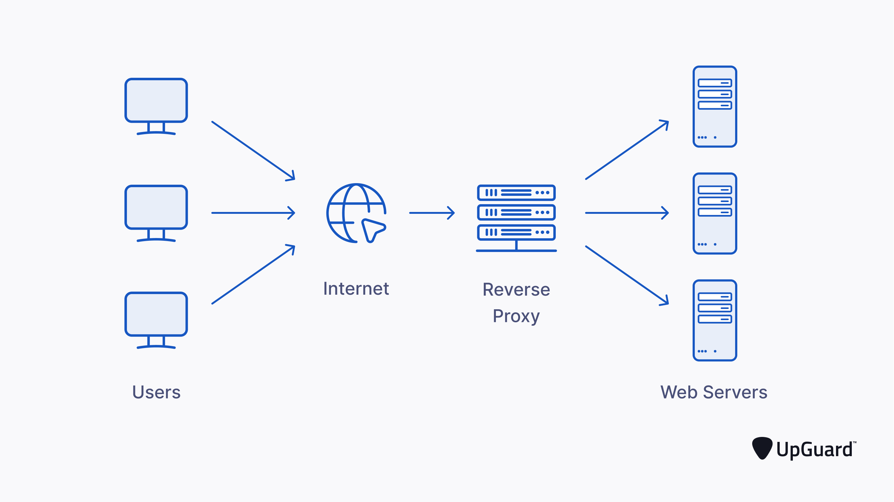

# Kong API Gateway

## What is an API Gateway?

An API gateway is used to manage multiple APIs by being the middle man between the client and all the backend services.

It acts as a **reverse proxy** and will forward all incoming traffic to various routes that can be configured by the developer.

There are two types of proxies, a **forward proxy** and a **reverse proxy**. We will only be talking about reverse proxies.

A **reverse proxy** is basically a server that acts as an _entry point_ or _gatekeeper_ to other servers (that is usually not exposed to the public).

> Reverse Proxies can also be used for other things.
> A VPN is also a reverse proxy.

## Benefits of using an API Gateway

### Load Balancing

API Gateways can provide load balancing which can route the same incoming request to different instances of a server, which will help distribute the workload evenly, instead of having one server to response to many requests.

This way, it is less likely a container/server will crash due to being overwhelmed with incoming requests.

### Security

A developer can completely hide their backend from the Internet and no one can access your API directly. This makes it harder to be hacked because all incoming request must go through the API Gateway.

By doing this, you only need to enable HTTPS on the gateway, and have your internal servers/containers communicate in HTTP.

### URL Rewriting

Using an API gateway, the developer can change the URL as they wish. This means that you can expose URLs that are more user-friendly or SEO-friendly, while your APIs can maintain its original URLs.

## Options

There are a lot of open source API gateways to choose from, such as:

- Kong API Gateway
- Tyk.io
- AWS API Gateway
- Apigee
- NGINX

They all have their benefits and distinct features, but **Kong API gateway** is by far the most popular.

Yes, NGINX is a web server but you can also configure it to be an API Gateway.

> Fun Fact: Kong is built on top of NGINX.

## What about Spring Cloud Gateway?

When developing a microservice using Spring Boot, it is incredibly easy to add Spring Cloud Gateway to your infrastructure as everything is already configured to work with each other. But Kong API gateway has a lot more features to offer.

### Reasons to use Spring Cloud Gateway

1. You want something really quick and easy to setup
2. **ALL** your microservices are Spring Boot services
3. You need to use Eureka Service Discovery

### Reasons to use Kong API Gateway

1. Kong provides an API where developers can simply add new services by sending POST request (no need to rebuild and redeploy any containers)

2. Kong provides **A LOT** of **_plugins_** (rate limiting, cors configuration, logging and monitoring, security, analytics, bot detection, etc), although some are paid plugins

### Service Discovery with Kong

Even though Kong **cannot** work with Netflix Eureka Server, there are other solutions. Most people would use Kong API Gateway with Kubernetes.

In Kubernetes, you can deploy several containers from the same image and Kubernetes will provide load balancing for each of your service.

### Summary

Use Spring Cloud Gateway for a quick and easy set up and if you’re not expecting the service to grow to an unmanageable scope.

If you have a project with a larger scope, it might be beneficial to use Kong for its incredible flexibility in configuration and wide variety of plugins. It only works if you’re already using Kubernetes for deployment, service discovery and load balancing. It is also convenient if you have to integrate it with other APIs in different projects or in different languages.

## [KONG Anatomy](./kong-anatomy.md)

## [Deploying KONG](./deploying-kong.md)
