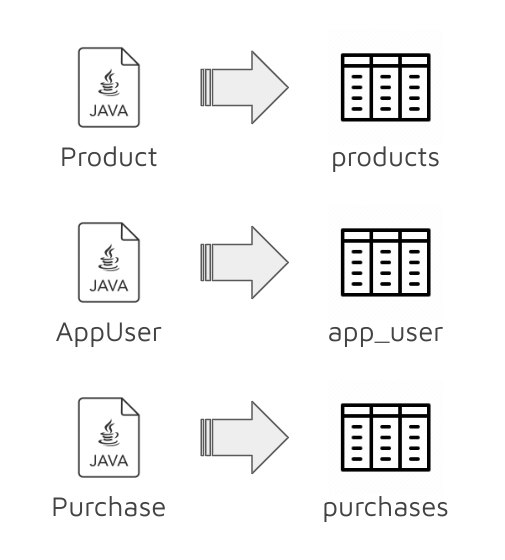
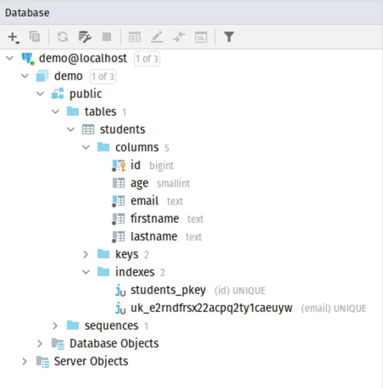
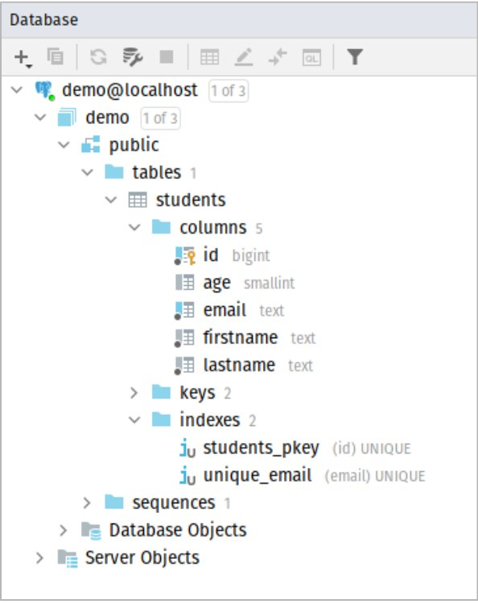

# Entities

## 1. JPA Entities

Entities in JPA are POJOs representing data
that can be persisted to the database. An entity represents a table stored in a database and each instance represents a row in the table.



### 1.1 Example 1

To create the table below, we can create a Java class that maps directly to it, using a few of the annotations provided by JPA.

```postgresql
CREATE TABLE students
(
    id        bigint NOT NULL PRIMARY KEy,
    age       smallint,
    email     text   NOT NULL,
    firstname text   NOT NULL,
    lastname  text   NOT NULL,

    CONSTRAINT unique_email UNIQUE(email),
);
```

```java
import jakarta.persistence.*;

@Entity
public class Student {

   @Id
   @GeneratedValue
   private Long id;
   private String firstname;
   private String lastname;
   private String email;
   private Integer age;
}

```

Let's analyze the `Student` classs and see what Hibernate is doing to our code.

1. `@Entity` maps the class to an Entity in Hibernate

2. `@Id` specifies the primary key of the table

3. `@GeneratedValue` specifies the auto-generation of the id

Hibernate will generate a table column for each member in the class.

> ### Note:
>
> In Spring Boot 3 (Spring Framework 6), the JPA annotations used need to be imported from the `jakarta.persistence` package. While in Spring Boot 2, they would need to be imported from `javax.persistence`.
>
> More about the changes here: https://www.infoq.com/news/2022/11/spring-6-spring-boot-3-launch/
>
> ### Here are the reasons:
>
> Spring Framework 6 requires Java 17 and Jakarta EE 9 and is also compatible with Jakarta EE 10. One of the major changes in Jakarta EE 9 is that the namespace has been changed from `javax.*` to `jakarta.*`. The renaming was done for legal reasons between Oracle and the Eclipse Foundation, which will not be covered in this book.
>
> More information here: https://www.baeldung.com/java-enterprise-evolution

If needed, the developer can map the column names to the properties manually if they need them to be different. Otherwise, JPA will implicitly convert Java's camelCase or PascalCase to snake_case in the PostgreSQL database.

```java
@Column(name = "student_id")
private Long id;

@Column(name = "first_name")
private String firstname;
```

Even though it's not strictly necessary, it is still best practice to explicitly declare the column names, even if they are exactly the same. This will help make the codebase more verbose and will eliminate any uncertainty during development and maintenance.

```java
@Entity
@Table(name = "student")
public class Student {

   @Id
   @GeneratedValue
   @Column(name = "student_id")
   private Long id;

   @Column(name = "firstname")
   private String firstname;

   @Column(name = "lastname")
   private String lastname;

   @Column(name = "email")
   private String email;

   @Column(name = "age")
   private Integer age;
}
```

## 2. Primary Key Generation

JPA provides 4 primary key generation strategies.

1. GenerationType.AUTO
2. GenerationType.IDENTITY
3. GenerationType.SEQUENCE
4. GenerationType.TABLE

Firstly, let's compare the IDENTITY and SEQUENCE strategy.

### 2.1. Identity vs. Sequence in RDBMS

> Identity sequencing uses special IDENTITY columns in the database to allow the database to automatically assign an id to the object when its row is inserted. Identity columns are supported in many databases, such as MySQL, DB2, SQL Server, Sybase and Postgres.

> Sequence objects use special database objects to generate ids. Sequence objects are only supported in some databases, such as Oracle, DB2, and Postgres. Usually, a SEQUENCE object has a name, an INCREMENT, and other database object settings.

In short, sequences are much more flexible in its usage and has no performance hits, so it is the recommended method of generating primary keys. More details on this point will be provided later.

Source: https://en.wikibooks.org/wiki/Java_Persistence/Identity_and_Sequencing

### 2.2 GenerationType.IDENTITY

As previously mentioned, the databaes will be asked to automatically generate a primary AFTER the data is inserted. There is nothing special about this generation strategy.

```java
@Id
@GeneratedValue(strategy = GenerationType.IDENTITY)
private Long id;
```

### 2.3 GenerationType.SEQUENCE

This will create a sequence object in the database, and will ask the sequence generator to provide the next number in the sequence. Only then, will it insert the records into the database.

```java
@Id
@GeneratedValue(strategy = GenerationType.SEQUENCE)
private Long id;
```

However, Hibernate by default uses a MUCH more efficient strategy to reduce SQL queries when asking for the next value in the sequence.

When Hibernate queries the databae for the next value, it will then generate the next 50 values in the sequence (by default it's 50) and stores it in memory, meaning the database will only be queried for the sequence once every 50 inserts.

The identity strategy does not provide the option for these kinds of optimizations.

To configure this allocation size, as well as to declare a new sequence, the developer can specify it in the `@SequenceGenerator` below.

```java
@Id
@GeneratedValue(
    strategy = GenerationType.SEQUENCE,
    generator = "book_generator"
)
@SequenceGenerator(
    name="book_generator",
    sequenceName = "book_seq", allocationSize=50
)
private Long id;
```

Source: https://stackoverflow.com/questions/17780394/hibernate-identity-vs-sequence-entity-identifier-generators

### 2.4 GenerationType.AUTO

This is the default generation strategy as is what JPA will use if no strategy is specified. Therefore, the two code blocks below are identical.

```java
@Id
@GeneratedValue(strategy = GenerationType.AUTO)
private Long id;
```

```java
@Id
@GeneratedValue
private Long id;
```

But how is the primary key generated?

It depends on the JPA implementation. The default set by the Hibernate team is `GenerationType.SEQUENCE` as it is the most performance-efficient strategy.

### 2.5 GenerationType.TABLE

This is by bar the least used and the least efficient strategy. How it works is that the latest generated ID is stored in a table and that table is queries everytime a primary key needs to be generated.

Another problem is that database tables use pessimistic locks, which puts all transactions in a sequential order, slowing down the entire application. This is why the sequence strategy is prefered.

```java
@Id
@GeneratedValue(
    strategy = GenerationType.TABLE,
    generator = "book_generator"
)
@TableGenerator(
    name="book_generator",
    table="id_generator",
    schema="bookstore"
)
private Long id;
```

The `@TableGenerator` annotation is optional for declaring the table to store information on primary key generation.

## 3. Column Definition

### 3.1 @Column

The `@Column` annotation is used to specify the mapped column for a persistent property or field. If no Column annotation is specified, the default values apply.

```java
@Id
@GeneratedValue
@Column(name = "first_name", nullable = false, unique = true)
private String firstName;
```

Should the developer need to explicitly declare the column data type to be used, they can declare them in the `columnDefinition` property in the `@Column` annotation.

```java
@Id
@GeneratedValue
@Column(name = "created_at", nullable = false, columnDefinition = "timestamp DEFAULT NOW()")
private LocalDateTime createdAt;
```

However, it should be noted that this makes the SQL code tighly coupled to the database.

Here are details for each attribute in the annotation.

- name: The name of the column.
- length: The column length.
- nullable: Whether the database column is nullable.
- table: The name of the table that contains the column.
- unique: Whether the column is a unique key.
- updatable: Whether the column is included in SQL UPDATE statements generated by the persistence provider.
- precision: The precision for a decimal (exact numeric) column.
- insertable: Whether the column is included in SQL INSERT statements generated by the persistence provider.
- columnDefinition: The SQL fragment that is used when generating the DDL for the column.

source: https://www.w3schools.blog/jpa-column-annotation

### 3.2 Hibernate Generated Constraints

When using `unique=true` in the `@Column`, Hibernate creates the relevant constraints, keys and database indexes, but generates a random string as it's name.



If needed, the developer can choose to explicitly declare the constraints using the `@Table`. For more details, visit section 4.1.

## 4 Table Definition

### 4.1 @Table

Below are the attributes that can be set in the `@Table` annotation.

- name: The name of the table. It is an optional attribute.
- schema: The schema of the table. It is an optional attribute.
- uniqueConstraints: Unique constraints that are to be placed on the table. It is an optional attribute.
- catalog: The catalog of the table. It is an optional attribute.
- indexes: Indexes for the table. It is an optional attribute.

Here, a unique constraint is created using the `@UniqueConstraint` annotation.

```java
@Table(
    name = "students",
    uniqueConstraints = {
       @UniqueConstraint(
            columnNames = "email",
            name = "unique_email")
    }
)
public class Student {
    //...
}
```



## 4.2 Indexes

It is also useful to note that Hibernate will create indexes automatically at startup after generating the table, based on the unique keys present (from primary keys and unique keys).

## Next

[Next Article](./entity-manager.md)

## References

Primary Key Generation https://thorben-janssen.com/jpa-generate-primary-keys/

Identity vs. Sequence https://www.sqlshack.com/difference-between-identity-sequence-in-sql-server/

Column https://www.objectdb.com/api/java/jpa/Column
