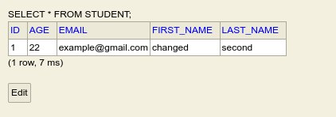
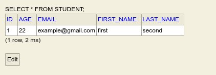

# Entity States

How does JPA know when to write data from an object to a table, or when an object is no longer valid?

JPA does this by managing its entities in 4 states.

1. Transient (New)
2. Persistent (Managed)
3. Detached (Unmanaged)
4. Removed (Deleted)

<!-- >Note: For sections 1-4, we will be injecting an EntityManagerFactory from a Persistence Unit.  -->

> Note: For sections 1-4, an EntityManager will be injected in order to manage the state of our entities.
> The details of the EntityManager will be covered in section [222]

```java
@Repository
public class StudentRepository {

    @PersistentContext
    private EntityManager entityManager;

    // crud functions here
}
```

## 1. Transient

An object that is newly created and has never been associated with JPA Persistence Context is considered to be in the "Transient" state.
The properties set in this object is not stored in the database.
It is a new object and will usually be moved to the "persistent" state by the entity manager.

Using the Student class created in section [222],
we can create a student entity by creating an object with the new keyword.
Because it is annotated with `@Entity` the created object will be managable by the EntityManager.

Another characteristic of a transient entity is that its @Id annotated property must be null. Only then will the entity manager insert it as a new record. 

```java
Student student = new Student(null, "first", "second", "example@gamil.com", 22);
```

## 2. Persistent

An instance of an entity (or simply a object) in the "persistent" state represents a record in the table.
A transient entity state can be changed to "persistent" by using the `persist()` method of the EntityManager.

```java
Student student = new Student(null, "first", "second", "example@gamil.com", 22);

entityManager.persist(student);
student.setFirstName("changed")
```

> Note: For the example provided in code block [333], it may be useful to ignore the EntityTransaction and EntityManager. As previously stated, it will be explained later. For now, it is not important.



As demonstrated, once an entity has been persisted,
any changes made to it afterwards will continue to be propagated to the database (until the transaction is commited).
It does not need to be saved or persisted again for the updated values to be entered into the databse.

## 3. Detached

An Object becomes detached when the currently running Persistence Context is closed (when a transaction is committed).
Any changes made to detached objects are no longer automatically propagated to the database.

```java
Student student = new Student(null, "first", "second", "example@gamil.com", 22);

entityManager.persist(student);
entityManager.detach(student);

student.setFirstName("changed")
```



In the code [333], trying to change any values in the `student` object will not do anything to the record in the table, as the entity instance has already been detached.

## Removed

When a persisted entity is removed, it means that the entity will be taken out of the persistent context and, consequently, deleted from the database.

```java
Long persistedId = 1L;
Student student = entityManager.find(Student.class, persistedId);
entityManager.remove(student);
```

## Reference

Overview:

https://jstobigdata.com/jpa/different-states-of-an-object-in-jpa

https://javarevisited.blogspot.com/2017/04/difference-between-transient-persistent-and-detached-state-hibernate-java.html

Understanding Persist vs. Merge:

https://www.baeldung.com/spring-data-crud-repository-save

https://stackoverflow.com/questions/1069992/jpa-entitymanager-why-use-persist-over-merge

Detecting an entity's state:

https://thorben-janssen.com/spring-data-jpa-state-detection/
