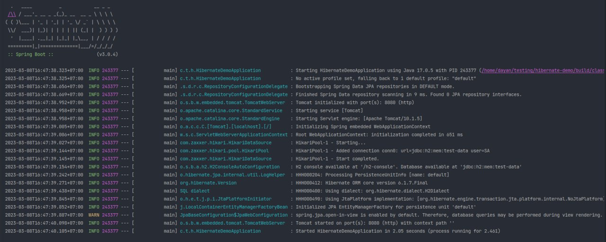

# Setup

For testing purpose, we will need the dependencies below:

1. Spring Data JPA (of course)
2. Spring Web
3. Lombok (to make development easier)
4. H2 Database (to avoid dealing with database setup)

```groovy
dependencies {
    implementation 'org.springframework.boot:spring-boot-starter-data-jpa'
    implementation 'org.springframework.boot:spring-boot-starter-web'
    compileOnly 'org.projectlombok:lombok'
    runtimeOnly 'com.h2database:h2'
    annotationProcessor 'org.projectlombok:lombok'
    testImplementation 'org.springframework.boot:spring-boot-starter-test'
}
```

Then add the configuration below to setup a connection to the H2 database.

```properties
spring.datasource.url=jdbc:h2:mem:test-data
spring.datasource.username=sa
spring.datasource.password=
spring.h2.console.enabled=true
```

This is enough to get the application running.


